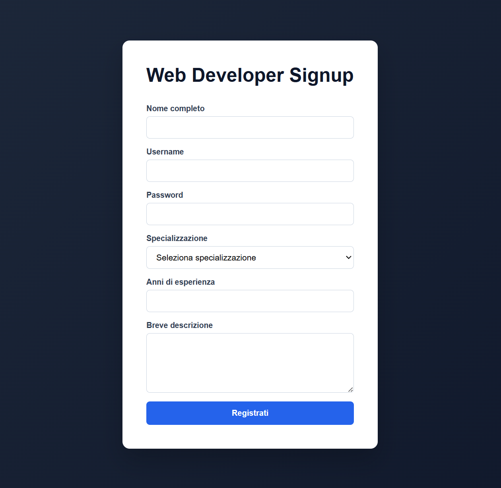

  

<h1 align="center">EX – Web Developer Signup (React)</h1>

Esercizio React sviluppato con **Vite**, focalizzato sulla gestione avanzata dei form e sull’utilizzo combinato di `useState`, `useMemo` e `useRef`.

Il progetto è strutturato seguendo **milestone incrementali**, per mostrare l’evoluzione da un form completamente controllato ad una gestione più ottimizzata tramite campi non controllati.

---

## Obiettivo dell’esercizio

- Creare un form di registrazione completo
- Gestire campi controllati con `useState`
- Implementare validazioni al submit
- Aggiungere validazione in tempo reale
- Ottimizzare la gestione dei campi con `useRef`

---

## Descrizione generale

L’applicazione simula un **form di registrazione per una piattaforma dedicata ai giovani sviluppatori web**.

L’utente deve inserire:

- Nome completo
- Username
- Password
- Specializzazione
- Anni di esperienza
- Breve descrizione personale

Il progetto evolve in tre fasi:

1. Gestione completa tramite campi controllati
2. Validazione in tempo reale di username, password e descrizione
3. Conversione parziale a campi non controllati tramite `useRef` per migliorare l’efficienza

L’esercizio è pensato per consolidare i concetti di:

- Controlled vs Uncontrolled Components
- Validazione lato client
- Memoizzazione con `useMemo`
- Gestione dei riferimenti con `useRef`

---

## Anteprima

---

## 📌 Milestone 1: Form con Campi Controllati

**Obiettivo:** Creare un form interamente controllato con validazione al submit.

### Requisiti

1. Gestire tutti i campi con `useState`.
2. Verificare al submit che:
   - Tutti i campi siano compilati
   - Gli anni di esperienza siano un numero positivo
   - La specializzazione sia selezionata
3. Stampare in console i dati se il form è valido.

---

## 📌 Milestone 2: Validazione in tempo reale

**Obiettivo:** Validare alcuni campi mentre l’utente digita.

### Requisiti

Validazione in tempo reale per:

- **Username**
  - Solo caratteri alfanumerici
  - Minimo 6 caratteri
  - Nessuno spazio o simbolo

- **Password**
  - Minimo 8 caratteri
  - Almeno una lettera
  - Almeno un numero
  - Almeno un simbolo

- **Descrizione**
  - Tra 100 e 1000 caratteri
  - Senza spazi iniziali e finali

Mostrare:
- Messaggio di errore (rosso) se non valido
- Messaggio di conferma (verde) se valido

---

## 📌 Milestone 3: Campi Non Controllati con useRef

**Obiettivo:** Ottimizzare la gestione del form convertendo alcuni campi in non controllati.

### Requisiti

1. Analizzare quali campi influenzano l’interfaccia in tempo reale.
2. Convertire i campi che non necessitano di aggiornamento continuo in campi non controllati.
3. Utilizzare `useRef` per recuperare i valori solo al submit.
4. Garantire che la validazione continui a funzionare correttamente.

In questa fase:
- Username, Password e Descrizione restano controllati.
- Nome completo, Specializzazione e Anni di esperienza vengono gestiti con `useRef`.

---

## Tecnologie utilizzate

- React
- Vite
